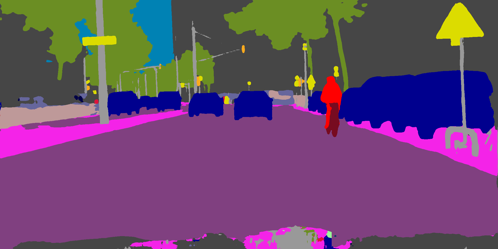

# MXNetSeg

This project provides modular implementation for state-of-the-art semantic segmentation models based on the [MXNet/Gluon](https://github.com/apache/incubator-mxnet) framework and [GluonCV](https://github.com/dmlc/gluon-cv) toolkit.



## Supported Models

- Attention to scale

  > Chen, Liang-Chieh, et al. "Attention to scale: Scale-aware semantic image segmentation." *Proceedings of the IEEE conference on computer vision and pattern recognition*. 2016.

- BiSeNet

  > Yu, Changqian, et al. "Bisenet: Bilateral segmentation network for real-time semantic segmentation." *Proceedings of the European conference on computer vision (ECCV)*. 2018.

- CANet

  > Tang, Quan, et al. "Attention-guided Chained Context Aggregation for Semantic Segmentation." *arXiv preprint arXiv:2002.12041* (2020).

- Deeplabv3/Deeplabv3+

  > Chen, Liang-Chieh, et al. "Rethinking atrous convolution for semantic image segmentation." *arXiv preprint arXiv:1706.05587* (2017).
  >
  > Chen, Liang-Chieh, et al. "Encoder-decoder with atrous separable convolution for semantic image segmentation." *Proceedings of the European conference on computer vision (ECCV)*. 2018.
  
- DenseASPP

  > Yang, Maoke, et al. "Denseaspp for semantic segmentation in street scenes." *Proceedings of the IEEE Conference on Computer Vision and Pattern Recognition*. 2018.

- FCN

  > Long, Jonathan, Evan Shelhamer, and Trevor Darrell. "Fully convolutional networks for semantic segmentation." *Proceedings of the IEEE conference on computer vision and pattern recognition*. 2015.

- LadderDenseNet

  > Kreso, Ivan, Sinisa Segvic, and Josip Krapac. "Ladder-style densenets for semantic segmentation of large natural images." *Proceedings of the IEEE International Conference on Computer Vision Workshops*. 2017.

- PSPNet

  > Zhao, Hengshuang, et al. "Pyramid scene parsing network." *Proceedings of the IEEE conference on computer vision and pattern recognition*. 2017.

- SeENet

  > Pang, Yanwei, et al. "Towards bridging semantic gap to improve semantic segmentation." *Proceedings of the IEEE International Conference on Computer Vision*. 2019.

- SwiftNet/SwiftNet-PR

  > Orsic, Marin, et al. "In defense of pre-trained imagenet architectures for real-time semantic segmentation of road-driving images." *Proceedings of the IEEE conference on computer vision and pattern recognition*. 2019.

## Benchmarks

We note that 'ss' denotes single scale testing and 'ms' multi-scale and flipping testing.

### Cityscapes

| Model     | Backbone  |  Dilate  |   TrainSet   | EvalSet | mIoU (ss) | mIoU (ms) |   OHEM   |
| :-------- | :-------: | :------: | :----------: | :-----: | :-------: | :-------: | :------: |
| FCN-32s   | ResNet18  | &#x2717; | *train_fine* |  *val*  |   64.94   |   68.08   | &#x2717; |
| FCN-32s   | ResNet18  | &#x2713; | *train_fine* |  *val*  |   68.28   |   69.86   | &#x2717; |
| FCN-32s   | ResNet101 | &#x2713; | *train_fine* |  *val*  |   74.54   |     -     | &#x2717; |
| PSPNet    | ResNet101 | &#x2713; | *train_fine* |  *val*  |   78.19   |   79.49   | &#x2717; |
| DeepLabv3 | ResNet101 | &#x2713; | *train_fine* |  *val*  |   78.72   |     -     | &#x2717; |
| DANet     | ResNet101 | &#x2713; | *train_fine* |  *val*  |   79.73   |   80.87   | &#x2717; |

## Environment

We adopt python 3.7.9 and CUDA 10.1 in this project.

1. Prerequisites

   ```shell
   pip install -r requirements.txt
   ```

   Note that we employ [wandb](https://github.com/wandb/client) for log and visualization. Refer to [here](https://docs.wandb.ai/quickstart) for a QuickStart.

2. [Detail API](https://github.com/zhanghang1989/detail-api) for Pascal Context dataset

## Usage

### Training

1. Configure hyper-parameters in `./mxnetseg/config.yml`

2. Run the `./mxnetseg/train.py` script

   ```shell
   python train.py --model fcn --ctx 0 1 2 3 --wandb wandb-demo
   ```

### Inference

Simply run the `./mxnetseg/eval.py` with arguments need to be specified

```shell
python eval.py --model fcn --backbone resnet18 --checkpoint fcn_resnet18_Cityscapes_20191900_310600_best.params --ctx 0 --data cityscapes --crop 768 --base 2048 --mode val --ms
```

About the `mode`:

- `val`: to get mIoU and PA metrics on the validation set.
- `test`: to get colored predictions on the test set.
- `testval`: to get colored predictions on the validation set.

## Citations

Please kindly cite our paper if you feel our codes help in your research.

```BibTex
@article{tang2020attention,
  title={Attention-guided Chained Context Aggregation for Semantic Segmentation},
  author={Tang, Quan and Liu, Fagui and Jiang, Jun and Zhang, Yu},
  journal={arXiv preprint arXiv:2002.12041},
  year={2020}
}
```

